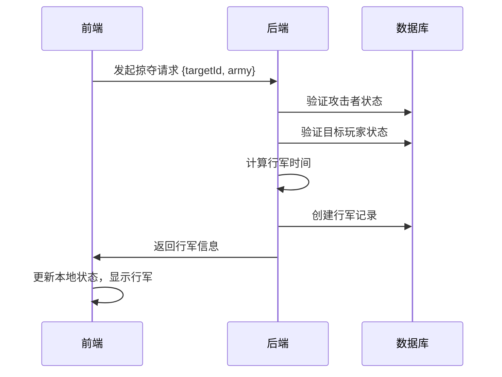
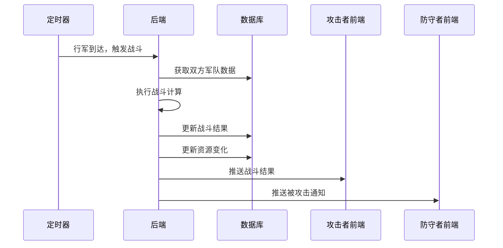

          
Ask😄：基于现有的状态管理系统分析，实现掠夺功能的数据基本够用，但需要扩展一些新的数据结构：

## 现有数据支持情况

### ✅ 已有且足够的数据

1. **军队数据** - 完全支持
```javascript
army: {
  'qingZhouArmy': 40,  // 青州军数量
  'huBaoQi': 20,       // 其他兵种
  // ...
}
```

2. **兵种属性** - 完全支持
```javascript
// factionConfig.js 中已定义
qingZhouArmy: {
  attack: 8,              // 攻击力
  infantryDefense: 7,     // 步兵防御
  cavalryDefense: 10,     // 骑兵防御
  speed: 6,               // 行军速度
  carryCapacity: 80       // 运载能力（掠夺容量）
}
```

3. **资源数据** - 完全支持
```javascript
resources: {
  wood: 1000,
  soil: 800, 
  iron: 600,
  food: 400
}
```

4. **阵营加成** - 完全支持
```javascript
traits: {
  militaryBonus: 1.8  // 军事加成影响战斗力
}
```

### ❌ 需要新增的数据结构

1. **战斗系统状态**
```javascript
// 需要新增 battleStore 或在 gameStore 中扩展
battleSystem: {
  // 正在进行的战斗
  activeBattles: [
    {
      id: 'battle_001',
      attackerId: 'player_123',
      defenderId: 'player_456', 
      attackerArmy: {
        'qingZhouArmy': 40,
        'huBaoQi': 10
      },
      defenderArmy: {
        'qingZhouArmy': 30,
        'jinWeiSoldier': 15
      },
      battleStartTime: 1703123456789,
      battleDuration: 300000, // 5分钟
      status: 'ongoing' // ongoing, completed
    }
  ],
  
  // 战斗历史记录
  battleHistory: [
    {
      id: 'battle_001',
      result: 'victory', // victory, defeat, draw
      loot: {
        wood: 500,
        soil: 300,
        iron: 200,
        food: 100
      },
      losses: {
        'qingZhouArmy': 5,
        'huBaoQi': 2
      },
      timestamp: 1703123456789
    }
  ]
}
```

2. **玩家交互数据**
```javascript
// 需要扩展用户系统
playerSystem: {
  // 当前玩家信息
  currentPlayer: {
    id: 'player_123',
    nickname: '玩家昵称',
    faction: 'wei',
    level: 15,
    coordinates: { x: 100, y: 200 } // 地图坐标
  },
  
  // 附近玩家列表（用于选择攻击目标）
  nearbyPlayers: [
    {
      id: 'player_456',
      nickname: '目标玩家',
      faction: 'shu',
      level: 12,
      coordinates: { x: 120, y: 180 },
      distance: 50, // 距离
      isOnline: true,
      lastActiveTime: 1703123456789
    }
  ]
}
```

3. **掠夺配置数据**
```javascript
// 需要在 gameConfig.js 中新增
export const RAID_CONFIG = {
  // 掠夺基础配置
  baseSettings: {
    maxRaidDistance: 100,        // 最大掠夺距离
    raidCooldown: 3600000,       // 掠夺冷却时间（1小时）
    maxDailyRaids: 10,           // 每日最大掠夺次数
    protectionTime: 86400000     // 新手保护时间（24小时）
  },
  
  // 掠夺计算公式
  calculation: {
    lootPercentage: 0.1,         // 掠夺资源比例（10%）
    carryCapacityMultiplier: 1.0, // 运载能力系数
    speedPenalty: 0.8,           // 满载时速度惩罚
    defenseBonus: 1.2            // 防守方加成
  },
  
  // 战斗力计算
  combatFormula: {
    attackWeight: 1.0,
    defenseWeight: 0.8,
    speedWeight: 0.2,
    randomFactor: 0.1  // 随机因素
  }
}
```

4. **行军系统数据**
```javascript
// 需要新增行军状态
marchSystem: {
  // 正在行军的部队
  activeMarchings: [
    {
      id: 'march_001',
      playerId: 'player_123',
      army: {
        'qingZhouArmy': 40
      },
      origin: { x: 100, y: 200 },
      destination: { x: 120, y: 180 },
      startTime: 1703123456789,
      arrivalTime: 1703123756789,
      purpose: 'raid', // raid, return, reinforce
      status: 'marching' // marching, arrived, returning
    }
  ]
}
```

## 实现建议

### 1. 扩展现有 gameStore
```javascript
// 在 gameStore.js 中新增
state: {
  // ... 现有状态
  
  // 新增掠夺相关状态
  raidSystem: {
    dailyRaidCount: 0,
    lastRaidTime: null,
    raidCooldownEnd: null
  }
}
```

### 2. 新建专门的战斗模块
```javascript
// src/store/modules/battleStore.js
// src/store/modules/raidStore.js
// src/store/modules/playerStore.js
```

### 3. 核心计算逻辑
```javascript
// 战斗力计算
calculateCombatPower(army, faction) {
  const factionConfig = getFactionConfig(faction)
  const militaryBonus = factionConfig.traits.militaryBonus
  
  let totalPower = 0
  Object.entries(army).forEach(([unitId, count]) => {
    const unit = getFactionUnit(faction, unitId)
    const unitPower = (unit.attack + unit.infantryDefense + unit.cavalryDefense) / 3
    totalPower += unitPower * count * militaryBonus
  })
  
  return totalPower
}

// 掠夺计算
calculateLoot(defenderResources, attackerArmy, victoryRatio) {
  const totalCarryCapacity = Object.entries(attackerArmy)
    .reduce((total, [unitId, count]) => {
      const unit = getUnitById(unitId)
      return total + (unit.carryCapacity * count)
    }, 0)
  
  const maxLoot = Math.min(
    totalCarryCapacity,
    Object.values(defenderResources).reduce((a, b) => a + b, 0) * 0.1 * victoryRatio
  )
  
  return distributeResources(maxLoot, defenderResources)
}
```

## 总结

现有数据结构为掠夺功能提供了良好的基础，特别是军队系统、兵种属性和资源管理已经完备。主要需要扩展的是：

1. **战斗系统** - 战斗计算、结果处理
2. **玩家交互** - 目标选择、距离计算
3. **行军系统** - 部队移动、时间计算
4. **掠夺规则** - 冷却时间、保护机制

建议采用模块化设计，新增专门的 store 模块来处理这些功能，保持代码的清晰和可维护性。
        


          
Ask😄：开发掠夺功能确实需要后端支持，主要原因和技术方案如下：

## 为什么需要后端支持

### 1. 数据安全性
- **防止作弊**: 前端数据可被篡改，战斗结果、掠夺数量等关键计算必须在后端进行
- **数据一致性**: 多玩家同时操作时，需要后端保证数据的一致性和完整性
- **反外挂**: 防止玩家通过修改前端代码获得不当优势

### 2. 实时性要求
- **多玩家交互**: 掠夺涉及两个玩家的数据变更，需要实时同步
- **状态同步**: 军队行军、战斗进行、资源变化等状态需要实时更新
- **冲突处理**: 同时攻击同一目标时的优先级和冲突解决

### 3. 复杂业务逻辑
- **战斗计算**: 复杂的战斗公式和随机因素需要服务端统一计算
- **规则验证**: 攻击距离、冷却时间、保护期等规则验证
- **数据持久化**: 战斗记录、掠夺历史等数据需要可靠存储

## 技术架构建议

### 1. 混合架构方案

#### 前端负责 (Vue3 + Pinia)
```javascript
// 前端主要处理UI交互和本地状态
- 界面展示和用户交互
- 本地数据缓存和临时状态
- 动画效果和用户体验
- 非关键数据的本地计算（如UI显示）
```

#### 后端负责 (Node.js/Python/Java)
```javascript
// 后端处理核心业务逻辑
- 战斗计算和结果判定
- 资源掠夺数量计算
- 玩家数据验证和更新
- 实时状态同步
- 数据持久化存储
```

### 2. 数据流设计

#### 发起掠夺流程


#### 战斗执行流程


### 3. 具体实现方案

#### 后端API设计
```javascript
// 掠夺相关API接口
POST /api/raid/initiate     // 发起掠夺
GET  /api/raid/targets      // 获取可攻击目标
GET  /api/raid/history      // 掠夺历史
POST /api/raid/recall       // 召回部队
GET  /api/march/status      // 行军状态查询

// WebSocket实时通信
ws://api/realtime           // 实时状态推送
```

#### 数据库设计
```sql
-- 玩家基础表
CREATE TABLE players (
  id VARCHAR(50) PRIMARY KEY,
  nickname VARCHAR(100),
  faction ENUM('wei','shu','wu'),
  level INT,
  coordinates_x INT,
  coordinates_y INT,
  protection_end_time TIMESTAMP,
  last_active_time TIMESTAMP
);

-- 军队表
CREATE TABLE armies (
  player_id VARCHAR(50),
  unit_id VARCHAR(50),
  count INT,
  PRIMARY KEY (player_id, unit_id)
);

-- 行军表
CREATE TABLE marches (
  id VARCHAR(50) PRIMARY KEY,
  player_id VARCHAR(50),
  target_id VARCHAR(50),
  army_data JSON,
  start_time TIMESTAMP,
  arrival_time TIMESTAMP,
  purpose ENUM('raid','return','reinforce'),
  status ENUM('marching','arrived','returning')
);

-- 战斗记录表
CREATE TABLE battles (
  id VARCHAR(50) PRIMARY KEY,
  attacker_id VARCHAR(50),
  defender_id VARCHAR(50),
  attacker_army JSON,
  defender_army JSON,
  result ENUM('victory','defeat','draw'),
  loot JSON,
  losses JSON,
  battle_time TIMESTAMP
);
```

### 4. 前后端协作模式

#### 前端状态管理扩展
```javascript
// src/store/modules/raidStore.js
export const useRaidStore = defineStore('raid', {
  state: () => ({
    // 本地缓存的目标列表
    nearbyTargets: [],
    // 正在进行的行军（从后端同步）
    activeMarchings: [],
    // 战斗历史（分页加载）
    battleHistory: [],
    // WebSocket连接状态
    isConnected: false
  }),
  
  actions: {
    // 发起掠夺（调用后端API）
    async initiateRaid(targetId, army) {
      const response = await raidAPI.initiate({ targetId, army })
      if (response.success) {
        this.activeMarchings.push(response.data.march)
        // 更新本地军队数量
        gameStore.updateArmyAfterMarch(army)
      }
      return response
    },
    
    // 处理实时推送
    handleRealtimeUpdate(data) {
      switch (data.type) {
        case 'march_arrival':
          this.updateMarchStatus(data.marchId, 'arrived')
          break
        case 'battle_result':
          this.addBattleResult(data.battle)
          break
        case 'under_attack':
          notificationStore.addWarningNotification('您的城池正在遭受攻击！')
          break
      }
    }
  }
})
```

#### WebSocket实时通信
```javascript
// src/services/websocket.js
class GameWebSocket {
  constructor() {
    this.ws = null
    this.reconnectAttempts = 0
    this.maxReconnectAttempts = 5
  }
  
  connect() {
    this.ws = new WebSocket('ws://localhost:3000/realtime')
    
    this.ws.onmessage = (event) => {
      const data = JSON.parse(event.data)
      // 分发到对应的store处理
      this.handleMessage(data)
    }
    
    this.ws.onclose = () => {
      this.handleReconnect()
    }
  }
  
  handleMessage(data) {
    const raidStore = useRaidStore()
    raidStore.handleRealtimeUpdate(data)
  }
}
```

### 5. 开发阶段建议

#### 第一阶段：模拟后端
```javascript
// 开发初期可以用前端模拟后端逻辑
// src/services/mockRaidAPI.js
export const mockRaidAPI = {
  async initiate(params) {
    // 模拟网络延迟
    await new Promise(resolve => setTimeout(resolve, 500))
    
    // 模拟战斗计算
    const result = this.simulateBattle(params)
    
    return {
      success: true,
      data: result
    }
  },
  
  simulateBattle(params) {
    // 简化的战斗逻辑
    const random = Math.random()
    return {
      result: random > 0.5 ? 'victory' : 'defeat',
      loot: random > 0.5 ? { wood: 100, soil: 80 } : {},
      losses: { [Object.keys(params.army)[0]]: Math.floor(Math.random() * 5) }
    }
  }
}
```

#### 第二阶段：真实后端
```javascript
// 后期替换为真实API调用
// src/services/raidAPI.js
import { apiClient } from './apiClient'

export const raidAPI = {
  async initiate(params) {
    return await apiClient.post('/api/raid/initiate', params)
  },
  
  async getTargets(coordinates) {
    return await apiClient.get('/api/raid/targets', { params: coordinates })
  },
  
  async getHistory(page = 1) {
    return await apiClient.get('/api/raid/history', { params: { page } })
  }
}
```

## 总结

掠夺功能必须有后端支持，主要原因是：

1. **安全性**: 防止作弊和数据篡改
2. **实时性**: 多玩家交互需要实时同步
3. **复杂性**: 战斗计算和业务规则验证
4. **可靠性**: 数据持久化和一致性保证

建议采用前后端分离的架构，前端负责UI交互，后端负责核心逻辑，通过API和WebSocket进行通信。开发初期可以用前端模拟后端逻辑进行原型验证。
        