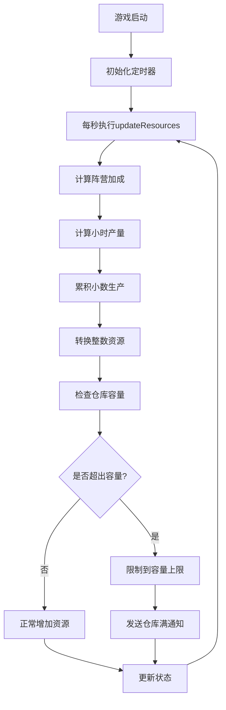
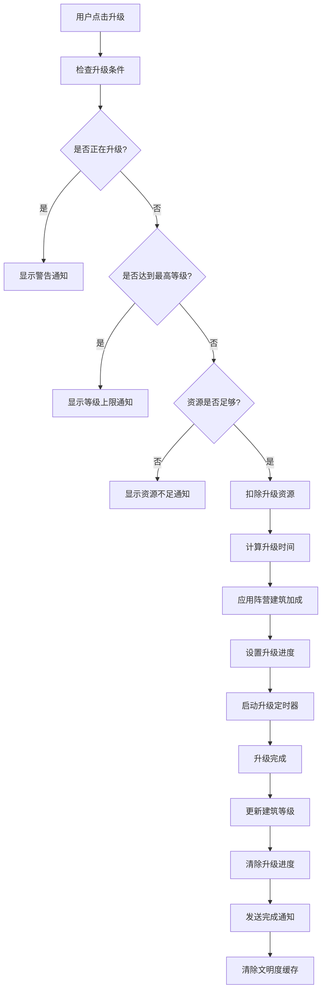
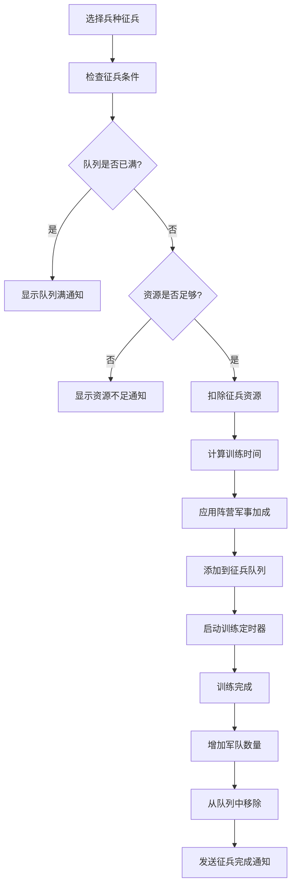

# 状态管理系统文档

## 概述

本文档详细说明了三国策略游戏的状态管理系统架构、数据结构、业务逻辑和技术实现。系统采用 Pinia 作为状态管理库，实现了模块化、响应式的状态管理方案。

## 系统架构

### 核心组成

```
src/store/
├── index.js                 # Pinia 入口文件
└── modules/
    ├── gameStore.js         # 游戏核心状态管理
    └── notificationStore.js # 通知系统状态管理
```

### 配置系统

```
src/config/
├── gameConfig.js           # 游戏基础配置
├── resources.js            # 资源配置
├── factionConfig.js        # 阵营配置
└── civilizationConfig.js   # 文明度配置
```

## 状态模块详解

### 1. 游戏核心状态 (gameStore)

#### 状态结构

```javascript
state: {
  // 用户信息
  userInfo: {
    nickname: '',
    faction: ''  // 'wei', 'shu', 'wu'
  },
  
  // 资源状态
  resources: {
    wood: 0,
    soil: 0, 
    iron: 0,
    food: 0
  },
  
  // 金币
  coins: 0,
  
  // 建筑等级状态
  buildings: {
    woodMill: [1, 1, 1, 1, 1],    // 5个伐木场等级
    soilMine: [1, 1, 1, 1, 1],    // 5个泥土矿等级
    ironMine: [1, 1, 1, 1, 1],    // 5个铁矿等级
    farm: [1, 1, 1, 1, 1]         // 5个农场等级
  },
  
  // 建筑升级进度
  buildingUpgrades: {
    // 格式: 'buildingType_index': { endTime, level }
  },
  
  // 仓库等级
  warehouseLevel: 1,
  
  // 仓库升级进度
  warehouseUpgrade: null,
  
  // 游戏暂停状态
  isPaused: false,
  
  // 累积生产量（处理小数精度）
  accumulatedProduction: {
    wood: 0,
    soil: 0,
    iron: 0,
    food: 0
  },
  
  // 军队状态
  army: {
    // 格式: unitId: count
  },
  
  // 征兵队列
  recruitmentQueue: [],
  
  // 征兵配置
  recruitmentConfig: {
    maxQueueSize: 10,
    defaultTrainTime: 60
  },
  
  // 文明度缓存
  civilizationCache: {
    value: null,
    timestamp: null,
    ttl: 5000  // 5秒缓存
  }
}
```

#### 核心 Getters

##### 资源生产计算
```javascript
// 每小时资源产量
hourlyProduction: (state) => {
  const faction = getFactionConfig(state.userInfo.faction)
  const economyBonus = faction?.traits?.economyBonus || 1.0
  
  return {
    wood: calculateProduction('woodMill', state.buildings.woodMill, economyBonus),
    soil: calculateProduction('soilMine', state.buildings.soilMine, economyBonus),
    iron: calculateProduction('ironMine', state.buildings.ironMine, economyBonus),
    food: calculateProduction('farm', state.buildings.farm, economyBonus)
  }
}

// 仓库容量
warehouseCapacity: (state) => {
  const baseCapacity = WAREHOUSE_CONFIG.baseCapacity
  const perLevelIncrease = WAREHOUSE_CONFIG.perLevelIncrease
  return baseCapacity + (state.warehouseLevel - 1) * perLevelIncrease
}
```

##### 文明度计算
```javascript
citycivilization: (state) => {
  // 使用缓存机制提高性能
  const now = Date.now()
  if (state.civilizationCache.value !== null && 
      now - state.civilizationCache.timestamp < state.civilizationCache.ttl) {
    return state.civilizationCache.value
  }
  
  const civilization = calculateCivilization(state.buildings, state.warehouseLevel)
  
  // 更新缓存
  state.civilizationCache = {
    value: civilization,
    timestamp: now,
    ttl: 5000
  }
  
  return civilization
}
```

##### 军事状态
```javascript
// 军队总数
totalArmyCount: (state) => {
  return Object.values(state.army).reduce((total, count) => total + count, 0)
}

// 是否正在征兵
isRecruiting: (state) => {
  return state.recruitmentQueue.length > 0
}
```

#### 核心 Actions

##### 资源更新
```javascript
updateResources() {
  if (this.isPaused) return
  
  const production = this.hourlyProduction
  const capacity = this.warehouseCapacity
  const updateInterval = 1000 // 1秒
  const hourlyToSecondly = 1 / 3600
  
  Object.keys(production).forEach(resource => {
    // 累积小数生产量
    this.accumulatedProduction[resource] += production[resource] * hourlyToSecondly
    
    // 转换为整数资源
    const integerPart = Math.floor(this.accumulatedProduction[resource])
    if (integerPart > 0) {
      const newAmount = Math.min(this.resources[resource] + integerPart, capacity)
      this.resources[resource] = newAmount
      this.accumulatedProduction[resource] -= integerPart
      
      // 仓库满时发送通知
      if (newAmount >= capacity) {
        notificationStore.addResourceFullNotification(resource)
      }
    }
  })
}
```

##### 建筑升级
```javascript
upgradeBuilding(buildingType, buildingIndex) {
  const upgradeKey = `${buildingType}_${buildingIndex}`
  
  // 检查升级条件
  if (this.buildingUpgrades[upgradeKey]) {
    notificationStore.addWarningNotification('建筑正在升级中')
    return false
  }
  
  const currentLevel = this.buildings[buildingType][buildingIndex]
  const buildingConfig = BUILDING_CONFIG[buildingType]
  
  if (currentLevel >= buildingConfig.maxLevel) {
    notificationStore.addWarningNotification('建筑已达到最高等级')
    return false
  }
  
  const cost = buildingConfig.cost[currentLevel]
  
  // 检查资源是否足够
  if (!this.canAfford(cost)) {
    notificationStore.addResourceInsufficientNotification()
    return false
  }
  
  // 扣除资源
  this.deductResources(cost)
  
  // 计算升级时间（应用阵营建筑加成）
  const faction = getFactionConfig(this.userInfo.faction)
  const buildingBonus = faction?.traits?.buildingBonus || 1.0
  const upgradeTime = Math.floor(buildingConfig.upgradeTime[currentLevel] / buildingBonus)
  
  // 设置升级进度
  const endTime = Date.now() + upgradeTime * 1000
  this.buildingUpgrades[upgradeKey] = {
    endTime,
    level: currentLevel + 1
  }
  
  // 设置升级完成定时器
  setTimeout(() => {
    this.completeBuildingUpgrade(buildingType, buildingIndex)
  }, upgradeTime * 1000)
  
  return true
}
```

##### 数据持久化
```javascript
saveGame() {
  const gameData = {
    userInfo: this.userInfo,
    resources: this.resources,
    coins: this.coins,
    buildings: this.buildings,
    buildingUpgrades: this.buildingUpgrades,
    warehouseLevel: this.warehouseLevel,
    warehouseUpgrade: this.warehouseUpgrade,
    isPaused: this.isPaused,
    accumulatedProduction: this.accumulatedProduction,
    army: this.army,
    recruitmentQueue: this.recruitmentQueue,
    recruitmentConfig: this.recruitmentConfig,
    lastSaveTime: Date.now()
  }
  
  localStorage.setItem('gameData', JSON.stringify(gameData))
}

loadGame() {
  const savedData = localStorage.getItem('gameData')
  if (!savedData) return
  
  try {
    const gameData = JSON.parse(savedData)
    
    // 数据兼容性处理
    if (gameData.buildings && !Array.isArray(gameData.buildings.woodMill)) {
      // 兼容旧版本数据结构
      this.convertOldBuildingData(gameData)
    }
    
    // 恢复状态
    Object.assign(this, gameData)
    
    // 恢复定时器
    this.restoreUpgradeTimers()
    this.restoreRecruitmentTimers()
    
  } catch (error) {
    console.error('加载游戏数据失败:', error)
  }
}
```

### 2. 通知系统状态 (notificationStore)

#### 状态结构

```javascript
state: {
  // 通知列表
  notifications: [],
  
  // 通知ID计数器
  notificationIdCounter: 0,
  
  // 默认显示时长
  defaultDuration: 3000,
  
  // 通知定时器映射
  notificationTimers: new Map()
}
```

#### 通知类型

```javascript
// 通知类型枚举
const NOTIFICATION_TYPES = {
  SUCCESS: 'success',
  WARNING: 'warning', 
  INFO: 'info',
  ERROR: 'error'
}
```

#### 核心功能

```javascript
// 添加通知
addNotification(message, type = 'info', duration = null) {
  const id = ++this.notificationIdCounter
  const notification = {
    id,
    message,
    type,
    timestamp: Date.now(),
    duration: duration || this.defaultDuration
  }
  
  this.notifications.push(notification)
  
  // 限制显示数量
  if (this.notifications.length > 5) {
    const removed = this.notifications.shift()
    this.clearNotificationTimer(removed.id)
  }
  
  // 设置自动移除定时器
  if (notification.duration > 0) {
    const timer = setTimeout(() => {
      this.removeNotification(id)
    }, notification.duration)
    
    this.notificationTimers.set(id, timer)
  }
}

// 专用通知方法
addResourceFullNotification(resourceType) {
  const resourceName = getResourceName(resourceType)
  this.addWarningNotification(`${resourceName}仓库已满，停止生产`)
}

addResourceInsufficientNotification() {
  this.addWarningNotification('资源不足，无法执行操作')
}

addBuildingUpgradeCompleteNotification(buildingName) {
  this.addSuccessNotification(`${buildingName} 升级完成！`)
}
```

## 配置系统详解

### 1. 游戏基础配置 (gameConfig.js)

#### 建筑配置
```javascript
export const BUILDING_CONFIG = {
  woodMill: {
    name: '伐木场',
    maxLevel: 30,
    production: [10, 12, 15, 18, 22, ...], // 每级产量
    cost: {
      1: { wood: 50, soil: 80, iron: 30, food: 20 },
      2: { wood: 60, soil: 100, iron: 40, food: 25 },
      // ...
    },
    upgradeTime: {
      1: 30,  // 升级到2级需要30秒
      2: 45,  // 升级到3级需要45秒
      // ...
    }
  },
  // 其他建筑类型...
}
```

#### 仓库配置
```javascript
export const WAREHOUSE_CONFIG = {
  baseCapacity: 1000,      // 基础容量
  perLevelIncrease: 500,   // 每级增加容量
  maxLevel: 30,            // 最大等级
  cost: {
    1: { wood: 200, soil: 300, iron: 150, food: 100 },
    // ...
  },
  upgradeTime: {
    1: 120,  // 升级时间（秒）
    // ...
  }
}
```

### 2. 阵营配置 (factionConfig.js)

#### 阵营特性
```javascript
export const FACTION_CONFIG = {
  wei: {
    name: '魏国',
    traits: {
      economyBonus: 1.8,    // 经济加成80%
      militaryBonus: 0.8,   // 军事加成-20%
      buildingBonus: 1.2    // 建筑速度加成20%
    },
    units: {
      // 兵种配置...
    }
  },
  shu: {
    name: '蜀国', 
    traits: {
      economyBonus: 1.2,    // 经济加成20%
      militaryBonus: 1.8,   // 军事加成80%
      buildingBonus: 0.8    // 建筑速度-20%
    }
  },
  wu: {
    name: '吴国',
    traits: {
      economyBonus: 0.8,    // 经济加成-20%
      militaryBonus: 1.2,   // 军事加成20%
      buildingBonus: 1.8    // 建筑速度加成80%
    }
  }
}
```

#### 兵种系统
```javascript
// 兵种类型
export const UNIT_TYPES = {
  INFANTRY: 'infantry',   // 步兵
  CAVALRY: 'cavalry',     // 骑兵
  SIEGE: 'siege',        // 攻城武器
  SPECIAL: 'special'     // 特殊兵种
}

// 兵种配置示例
units: {
  qingZhouArmy: {
    name: '青州军',
    attack: 8,
    infantryDefense: 7,
    cavalryDefense: 10,
    speed: 6,
    carryCapacity: 80,
    unitType: UNIT_TYPES.INFANTRY,
    cost: { wood: 240, soil: 200, iron: 360, food: 80 },
    trainTime: 60
  }
}
```

### 3. 文明度配置 (civilizationConfig.js)

#### 文明度等级
```javascript
export const CIVILIZATION_LEVELS = [
  { threshold: 1000, level: '繁荣昌盛', color: 'text-purple-600' },
  { threshold: 500, level: '兴旺发达', color: 'text-blue-600' },
  { threshold: 200, level: '蒸蒸日上', color: 'text-green-600' },
  { threshold: 100, level: '小有成就', color: 'text-yellow-600' },
  { threshold: 50, level: '初具规模', color: 'text-orange-600' },
  { threshold: 0, level: '起步发展', color: 'text-gray-600' }
]
```

#### 文明度计算
```javascript
export function calculateCivilization(buildings, warehouseLevel) {
  // 计算总产量分数
  const totalProduction = Object.values(buildings).flat()
    .reduce((total, level) => total + level * 10, 0)
  const productionScore = totalProduction / 10
  
  // 计算建筑等级分数
  const buildingLevelScore = Object.values(buildings).flat()
    .reduce((sum, level) => sum + level, 0) * 2
  
  // 仓库加成
  const warehouseBonus = warehouseLevel * 5
  
  return Math.max(1, productionScore + buildingLevelScore + warehouseBonus)
}
```

## 状态流转机制

### 1. 资源生产流程



### 2. 建筑升级流程



### 3. 征兵系统流程



## 性能优化策略

### 1. 缓存机制

#### 文明度缓存
```javascript
// 文明度计算较为复杂，使用缓存减少重复计算
civilizationCache: {
  value: null,
  timestamp: null,
  ttl: 5000  // 5秒缓存时间
}
```

#### 缓存失效策略
```javascript
// 建筑升级完成时清除缓存
completeBuildingUpgrade(buildingType, buildingIndex) {
  // 更新建筑等级
  this.buildings[buildingType][buildingIndex] = this.buildingUpgrades[upgradeKey].level
  
  // 清除文明度缓存
  this._clearCivilizationCache()
}

_clearCivilizationCache() {
  this.civilizationCache = {
    value: null,
    timestamp: null,
    ttl: 5000
  }
}
```

### 2. 精度处理

#### 小数累积机制
```javascript
// 避免浮点数精度问题
accumulatedProduction: {
  wood: 0,
  soil: 0,
  iron: 0,
  food: 0
}

// 累积小数，达到整数时才更新资源
this.accumulatedProduction[resource] += production[resource] * hourlyToSecondly
const integerPart = Math.floor(this.accumulatedProduction[resource])
if (integerPart > 0) {
  this.resources[resource] += integerPart
  this.accumulatedProduction[resource] -= integerPart
}
```

### 3. 定时器管理

#### 升级定时器恢复
```javascript
restoreUpgradeTimers() {
  Object.entries(this.buildingUpgrades).forEach(([upgradeKey, upgrade]) => {
    const remainingTime = Math.max(0, upgrade.endTime - Date.now())
    if (remainingTime > 0) {
      setTimeout(() => {
        const [buildingType, buildingIndex] = upgradeKey.split('_')
        this.completeBuildingUpgrade(buildingType, parseInt(buildingIndex))
      }, remainingTime)
    } else {
      // 升级时间已过，立即完成
      const [buildingType, buildingIndex] = upgradeKey.split('_')
      this.completeBuildingUpgrade(buildingType, parseInt(buildingIndex))
    }
  })
}
```

## 数据持久化

### 1. 存储策略

#### 自动保存
```javascript
// 状态变更时自动保存
watch: {
  resources: {
    handler() {
      this.saveGame()
    },
    deep: true
  },
  buildings: {
    handler() {
      this.saveGame()
    },
    deep: true
  }
}
```

#### 数据压缩
```javascript
// 只保存必要数据，减少存储空间
saveGame() {
  const gameData = {
    userInfo: this.userInfo,
    resources: this.resources,
    buildings: this.buildings,
    // 不保存缓存数据
    // civilizationCache: this.civilizationCache,
    lastSaveTime: Date.now()
  }
  
  localStorage.setItem('gameData', JSON.stringify(gameData))
}
```

### 2. 版本兼容

#### 数据结构迁移
```javascript
loadGame() {
  const gameData = JSON.parse(savedData)
  
  // 检查数据版本
  if (!gameData.version || gameData.version < CURRENT_VERSION) {
    this.migrateGameData(gameData)
  }
  
  // 兼容旧版本建筑数据结构
  if (gameData.buildings && !Array.isArray(gameData.buildings.woodMill)) {
    this.convertOldBuildingData(gameData)
  }
}

convertOldBuildingData(gameData) {
  // 将旧版本的对象结构转换为数组结构
  const newBuildings = {}
  Object.keys(gameData.buildings).forEach(buildingType => {
    newBuildings[buildingType] = Array(5).fill(1)
    // 迁移逻辑...
  })
  gameData.buildings = newBuildings
}
```

## 错误处理

### 1. 状态恢复

```javascript
try {
  const gameData = JSON.parse(savedData)
  Object.assign(this, gameData)
} catch (error) {
  console.error('加载游戏数据失败:', error)
  // 使用默认状态
  this.resetToDefault()
  notificationStore.addErrorNotification('游戏数据损坏，已重置为初始状态')
}
```

### 2. 操作验证

```javascript
// 资源扣除前验证
canAfford(cost) {
  return Object.entries(cost).every(([resource, amount]) => {
    return this.resources[resource] >= amount
  })
}

// 安全的资源扣除
deductResources(cost) {
  if (!this.canAfford(cost)) {
    throw new Error('资源不足，无法扣除')
  }
  
  Object.entries(cost).forEach(([resource, amount]) => {
    this.resources[resource] -= amount
  })
}
```

## 扩展性设计

### 1. 模块化架构

```javascript
// 新增功能模块
src/store/modules/
├── gameStore.js          # 核心游戏状态
├── notificationStore.js  # 通知系统
├── battleStore.js        # 战斗系统（待扩展）
├── tradeStore.js         # 贸易系统（待扩展）
└── allianceStore.js      # 联盟系统（待扩展）
```

### 2. 插件系统

```javascript
// 状态插件接口
export class StatePlugin {
  install(store) {
    // 插件安装逻辑
  }
  
  beforeAction(actionName, payload) {
    // 动作执行前钩子
  }
  
  afterAction(actionName, payload, result) {
    // 动作执行后钩子
  }
}
```

### 3. 事件系统

```javascript
// 状态变更事件
const eventBus = new EventTarget()

// 发布状态变更事件
emitStateChange(stateName, oldValue, newValue) {
  eventBus.dispatchEvent(new CustomEvent('stateChange', {
    detail: { stateName, oldValue, newValue }
  }))
}

// 订阅状态变更
eventBus.addEventListener('stateChange', (event) => {
  const { stateName, oldValue, newValue } = event.detail
  // 处理状态变更
})
```

## 最佳实践

### 1. 状态设计原则

- **单一数据源**: 所有状态集中在 store 中管理
- **状态不可变**: 通过 actions 修改状态，避免直接修改
- **最小化状态**: 只存储必要的状态，派生状态通过 getters 计算
- **模块化**: 按功能划分不同的 store 模块

### 2. 性能优化

- **缓存机制**: 对复杂计算结果进行缓存
- **批量更新**: 避免频繁的小量更新
- **懒加载**: 按需加载状态模块
- **内存管理**: 及时清理不需要的定时器和监听器

### 3. 调试支持

```javascript
// 开发环境下的状态调试
if (process.env.NODE_ENV === 'development') {
  // 状态变更日志
  store.$subscribe((mutation, state) => {
    console.log('State mutation:', mutation)
    console.log('Current state:', state)
  })
  
  // 暴露到全局用于调试
  window.__GAME_STORE__ = store
}
```

## 总结

本状态管理系统通过 Pinia 实现了完整的游戏状态管理，具有以下特点：

1. **完整性**: 覆盖了游戏的所有核心功能状态
2. **响应式**: 状态变更自动触发 UI 更新
3. **持久化**: 支持本地存储和数据恢复
4. **性能优化**: 缓存、批量更新、精度处理
5. **扩展性**: 模块化设计，易于扩展新功能
6. **健壮性**: 完善的错误处理和数据验证

系统为三国策略游戏提供了稳定、高效的状态管理基础，支持复杂的游戏逻辑和用户交互。