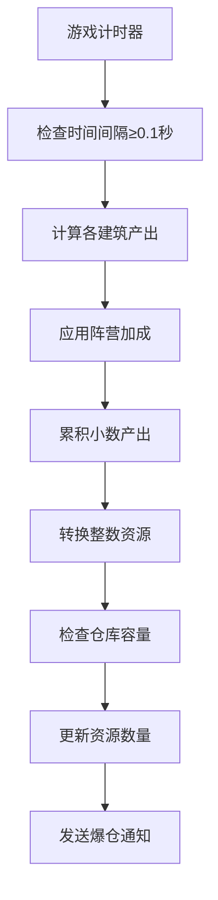
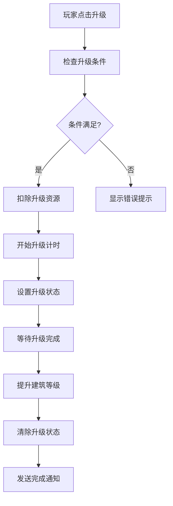
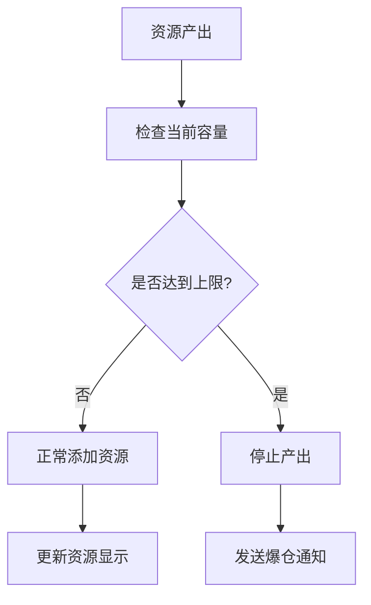

# 武林三国 - 资源管理系统文档

## 📋 概述

武林三国是一款文字放置类游戏，资源管理是游戏的核心系统之一。本文档详细说明了资源系统的业务逻辑和技术实现。

## 🎯 资源类型

游戏中包含四种基础资源：

| 资源类型 | 中文名称 | 英文标识 | 图标描述 | 用途 |
|---------|---------|---------|---------|-----|
| Wood | 木材 | `wood` | 绿色树木图标 | 建筑升级、征兵 |
| Soil | 泥土 | `soil` | 棕色土壤图标 | 建筑升级、征兵 |
| Iron | 铁矿 | `iron` | 灰色矿石图标 | 建筑升级、征兵 |
| Food | 粮食 | `food` | 金色麦穗图标 | 建筑升级、征兵 |

## 🏭 资源建筑系统

### 建筑类型

每种资源对应一种专门的生产建筑：

| 建筑类型 | 中文名称 | 生产资源 | 最高等级 |
|---------|---------|---------|----------|
| `woodMill` | 伐木场 | 木材 | 20级 |
| `soilMine` | 泥土矿 | 泥土 | 20级 |
| `ironMine` | 铁矿场 | 铁矿 | 20级 |
| `farm` | 农场 | 粮食 | 20级 |

### 建筑数量配置

- 每种资源类型可建造 **5个独立建筑**
- 每个建筑可独立升级，互不影响
- 初始状态：第一个建筑为1级，其余为0级（未建造）

### 产量配置

建筑产量采用手动配置方式，每级产量精确定义：

```javascript
// 示例：伐木场产量配置（每小时）
productionByLevel: [
  4,     // 0级
  10,    // 1级
  18,    // 2级
  30,    // 3级
  44,    // 4级
  66,    // 5级
  100,   // 6级
  // ... 最高到20级
]
```

## 💰 资源产出机制

### 产出计算公式

```javascript
总产量 = Σ(单个建筑产量 × 阵营加成)
```

### 阵营加成系统

不同阵营对经济产出有不同的加成效果：
- 基础加成：1.0（无加成）
- 阵营加成：根据玩家选择的阵营应用相应的经济加成倍数

### 实时产出更新

资源产出采用实时更新机制：

1. **更新频率**：每0.1秒检查一次
2. **精度处理**：使用累积产出缓存处理小数产出
3. **计算方式**：`(每小时产出 / 3600秒) × 经过秒数`

```javascript
// 产出计算示例
const producedFloat = (production[resourceType] / 3600) * seconds
this.accumulatedProduction[resourceType] += producedFloat

// 当累积产出≥1时，转换为整数资源
const integerProduced = Math.floor(this.accumulatedProduction[resourceType])
```

## 📦 仓库系统

### 仓库容量

- **初始等级**：1级
- **最高等级**：根据配置文件定义
- **容量计算**：通过 `calculateWarehouseCapacity(level)` 函数计算

### 容量限制机制

1. **上限检查**：资源产出时自动检查是否超过仓库容量
2. **爆仓提醒**：当资源达到上限时，系统自动发送通知
3. **产出停止**：资源达到上限后停止继续产出

```javascript
// 容量限制实现
const newAmount = Math.min(currentAmount + produced, warehouseCapacity)
```

## 🔧 升级系统

### 建筑升级

#### 升级条件检查

1. **资源充足**：检查是否有足够的升级资源
2. **非升级状态**：确保建筑当前未在升级中
3. **等级限制**：确保未达到最高等级

#### 升级成本计算

```javascript
// 升级成本通过配置文件计算
const cost = calculateUpgradeCost(buildingType, currentLevel)
```

#### 升级时间机制

- **时间计算**：通过 `calculateUpgradeTime()` 函数计算
- **异步处理**：使用 `setTimeout` 实现升级定时器
- **状态管理**：升级期间建筑状态标记为升级中

### 仓库升级

仓库升级遵循与建筑升级相同的机制：
- 资源消耗检查
- 升级时间计算
- 异步完成处理

## 🎮 游戏状态管理

### 状态存储结构

```javascript
state: {
  // 资源数据
  resources: {
    wood: 100,
    soil: 100,
    iron: 100,
    food: 100
  },
  
  // 建筑等级（每种5个建筑）
  buildings: {
    woodMill: [1, 0, 0, 0, 0],
    soilMine: [1, 0, 0, 0, 0],
    ironMine: [1, 0, 0, 0, 0],
    farm: [1, 0, 0, 0, 0]
  },
  
  // 升级进度
  buildingUpgrades: {
    woodMill: [null, null, null, null, null],
    // ...
  },
  
  // 累积产出缓存
  accumulatedProduction: {
    wood: 0,
    soil: 0,
    iron: 0,
    food: 0
  }
}
```

### 数据持久化

- **存储方式**：localStorage 本地存储
- **保存时机**：用户信息变更、手动保存
- **数据兼容**：支持旧版本数据结构的兼容性处理

## 🔄 核心业务流程

### 1. 资源产出流程



### 2. 建筑升级流程



### 3. 仓库管理流程



## 📊 性能优化

### 1. 文明度计算缓存

```javascript
// 缓存机制避免频繁计算
_civilizationCache: {
  value: null,
  lastCalculatedAt: 0,
  cacheTimeout: 1000 // 缓存1秒
}
```

### 2. 累积产出优化

- 使用浮点数累积避免精度丢失
- 只有累积值≥1时才转换为整数资源
- 减少频繁的状态更新

### 3. 定时器管理

- 游戏暂停时停止资源更新
- 页面重新加载时恢复升级定时器
- 避免重复创建定时器

## 🎨 用户界面

### 资源显示组件 (ResourceBar)

- **实时显示**：当前资源数量/仓库容量
- **产出显示**：每小时产出量
- **进度条**：资源容量使用情况
- **操作按钮**：仓库升级、游戏暂停/恢复

### 建筑管理界面

- **网格布局**：4列显示4种资源建筑
- **等级显示**：每个建筑的当前等级
- **升级按钮**：支持单独升级每个建筑
- **进度显示**：升级中的建筑显示剩余时间

## 🔮 扩展性设计

### 1. 新资源类型

- 在 `RESOURCE_TYPES` 中添加新类型
- 配置对应的建筑类型和产量
- 更新UI组件支持新资源显示

### 2. 建筑数量扩展

- 修改建筑数组长度（当前为5个）
- 更新UI布局支持更多建筑
- 调整存储结构兼容性

### 3. 复杂产出公式

- 支持多资源消耗型建筑
- 实现资源转换建筑
- 添加时间相关的产出加成

## 🐛 常见问题

### Q: 为什么资源产出有小数？
A: 游戏使用累积产出机制，小数部分会累积到下次更新，确保产出精度。

### Q: 升级失败的原因？
A: 检查资源是否充足、建筑是否正在升级中、是否已达最高等级。

### Q: 仓库爆满怎么办？
A: 升级仓库增加容量，或消耗资源进行建筑升级、征兵等操作。

### Q: 数据丢失如何恢复？
A: 游戏数据保存在浏览器localStorage中，清除浏览器数据会导致丢失，建议定期手动保存。

---

**文档版本**: v1.0  
**最后更新**: 2024年12月  
**维护者**: 武林三国开发团队